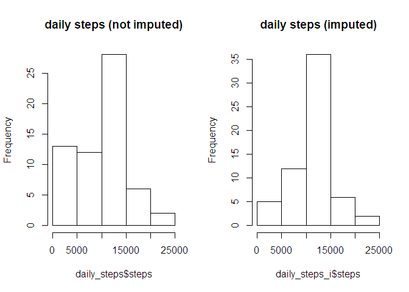

## Loading and preprocessing the data

```r
#unzip the .zip repository if the file does not already exist
if (!file.exists('activity.csv')){unzip('activity.zip') }


#load into "activity" dataframe
activity <- read.csv('activity.csv') 

#Convert "date" column into data format
activity$date <- as.Date(activity$date)

head(activity)
```

```
##   steps       date interval
## 1    NA 2012-10-01        0
## 2    NA 2012-10-01        5
## 3    NA 2012-10-01       10
## 4    NA 2012-10-01       15
## 5    NA 2012-10-01       20
## 6    NA 2012-10-01       25
```

## 1: What is mean total number of steps taken per day?
1. Calculate the total number of daily steps:

```r
daily_steps <- aggregate(activity['steps'],by=activity['date'],sum,na.rm=TRUE)
```

2. plot a histogram of daily steps

```r
hist(daily_steps$steps)
```

<!-- -->

3. Calculate and report the mean and median of the total number of steps taken per day

```r
mean_steps <- mean(daily_steps$steps)
median_steps <- median(daily_steps$steps)
```

### The mean total number of steps each day is **9354.23**, and the median is **10395**.

## 2. What is the average daily activity pattern?
1. Make a time-series plot of average steps per five-minute interval

```r
#aggregate data by interval
avg_day <- aggregate(activity['steps'],by=activity['interval'],mean,na.rm=TRUE)

#make a line plot
plot(avg_day$interval,avg_day$steps,type='l')
```

<!-- -->


2. Which 5-minute interval, on average across all the days in the dataset, contains the maximum number of steps?

```r
max_index <- which.max(avg_day$steps)
max_interval <- avg_day$interval[max_index]
max_steps <- avg_day$steps[max_index]
```

### The interval with the most steps on average is **835** with **206.1698** steps

## 3. Imputing missing values

1. Calculate and report the total number of missing values in the dataset (i.e. the total number of rows with NAs)

```r
nas <- sum(is.na(activity$steps))
```
There are **2304** NA values in the dataset.

2. Devise a strategy for filling in all of the missing values in the dataset. The strategy does not need to be sophisticated. For example, you could use the mean/median for that day, or the mean for that 5-minute interval, etc.

     *The strategy selected is to fill in missing values with the mean steps value for that specific interval.* 

3. Create a new dataset that is equal to the original dataset but with the missing data filled in.

```r
# set interval as rownames of avg_day and remove interval as a data value
rownames(avg_day) <- avg_day$interval
avg_day$interval <- NULL
```


```r
#make a copy of activity data (activity_1 stands for "imputed")
activity_i <- data.frame(activity)

#create boolean filter for NA values of activity$steps
filter <- is.na(activity_i$steps)

#assign mean values to NAs in activity dataset
activity_i$steps[filter] <- avg_day[as.character(activity_i$interval[filter]),]

#check values to ensure no more NAs:
sum(is.na(activity_i$steps))
```

```
## [1] 0
```

```r
head(activity_i)
```

```
##       steps       date interval
## 1 1.7169811 2012-10-01        0
## 2 0.3396226 2012-10-01        5
## 3 0.1320755 2012-10-01       10
## 4 0.1509434 2012-10-01       15
## 5 0.0754717 2012-10-01       20
## 6 2.0943396 2012-10-01       25
```

```r
#from the data import step, we remember that at least the first 6 rows of activity were NA. 
#as a test, let's ensure the first 6 rows match the first 6 rows of avg_day.
head(activity_i)$steps == head(avg_day)$steps
```

```
## [1] TRUE TRUE TRUE TRUE TRUE TRUE
```

4. Make a histogram of the total number of steps taken each day and Calculate and report the mean and median total number of steps taken per day. Do these values differ from the estimates from the first part of the assignment? What is the impact of imputing missing data on the estimates of the total daily number of steps?

```r
#1. Calculate the total number of daily steps:
daily_steps_i <- aggregate(activity_i['steps'],by=activity_i['date'],sum,na.rm=TRUE)

#2. plot a histogram of daily steps imputed compared to daily steps not imputed
par(mfrow=c(1,2))
hist(daily_steps$steps,main="daily steps (not imputed)")
hist(daily_steps_i$steps, main="daily steps (imputed)")
```

<!-- -->

```r
#3. Calculate the mean and median of the imputed dataset
mean_steps_i <- mean(daily_steps_i$steps)
median_steps_i <- median(daily_steps_i$steps)
```

### After imputing missing data, the mean total number of steps each day is **10766.19**, and the median is **10766.19**. This represents an increase in the median steps of 15%.
*The median and the mean lining up exactly in this case is an artifact of imputing the missing values using the mean of non-missing values.*

## 4. Are there differences in activity patterns between weekdays and weekends?

1. Create a new factor variable in the dataset with two levels – “weekday” and “weekend” indicating whether a given date is a weekday or weekend day.

```r
#create boolean of weekday and weekend values (TRUE = weekend, FALSE = weekday)
wd_bool <- weekdays(activity_i$date) %in% c('Saturday','Sunday')
#create string vector to record weekday/weekend values (initialized as all "weekday")
wd <- rep("weekday",length(wd_bool))
#assign weekends as "weekend" 
wd[wd_bool] <- "weekend"
#turn it into a factor
wd <- factor(wd)
#add it to the dataframe
activity_i$wd <- wd
head(activity_i)
```

```
##       steps       date interval      wd
## 1 1.7169811 2012-10-01        0 weekday
## 2 0.3396226 2012-10-01        5 weekday
## 3 0.1320755 2012-10-01       10 weekday
## 4 0.1509434 2012-10-01       15 weekday
## 5 0.0754717 2012-10-01       20 weekday
## 6 2.0943396 2012-10-01       25 weekday
```

2. Make a panel plot containing a time series plot of the 5-minute interval (x-axis) and the average number of steps taken, averaged across all weekday days or weekend days (y-axis). See the README file in the GitHub repository to see an example of what this plot should look like using simulated data.


```r
#load libraries
library(dplyr)
```

```
## 
## Attaching package: 'dplyr'
```

```
## The following objects are masked from 'package:stats':
## 
##     filter, lag
```

```
## The following objects are masked from 'package:base':
## 
##     intersect, setdiff, setequal, union
```

```r
library(ggplot2)
#summarize average steps per interval for weekday/weekend
avg_wdwe <- activity_i %>%
  group_by(wd,interval)%>%
  summarize(mean_steps = mean(steps))
#plot data
qplot(x=interval,y=mean_steps,geom = "line",data=avg_wdwe) + facet_grid(.~wd)
```

<!-- -->
